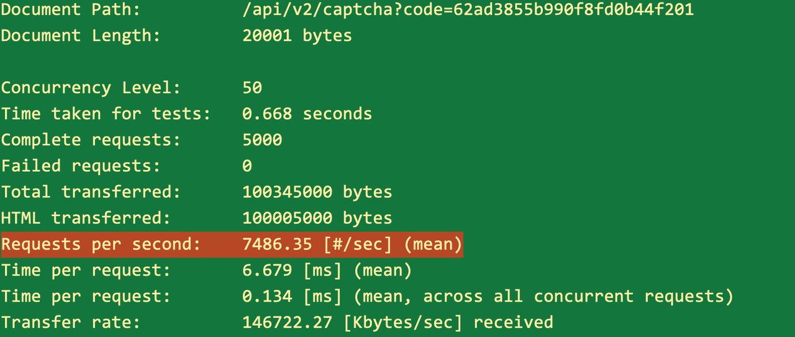
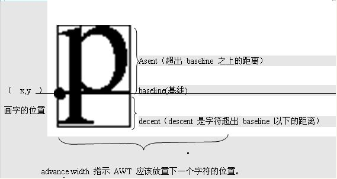
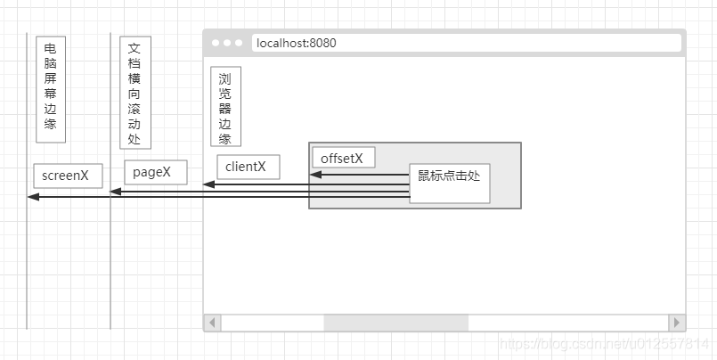

### Overview
这是一个轻量的高性能，容易水平扩展的防机器人验证图片程序，也是一个WebFlux和容器化案例。
启动代码后，可以访问 ./demo.html 查看效果。
This is a lightweight, high-performance and easily horizontally scalable captcha image program, and also a WebFlux and containerization example. After starting the application, you can visit /demo.html to see the demo.

### Feature list
* 基于Reactive(webflux + lettuce)实现，各接口在普通2018MBP上本地压测qps表现近约10k/s；
* 支持docker部署（单容器 all-in-one 一个容器包涵java程序+依赖的redis，这样可以方便的做容器扩容）
* reactive模式，请使用/api/v2/下的接口
* Implemented based on Reactive (webflux + lettuce) architecture, each interface has local pressure test qps performance of around 10k/s on a normal 2018 MBP;
* Supports docker deployment (single container all-in-one, with java program + dependent redis in one container, for easy container scaling)
* reactive pattern, please use interfaces under /api/v2/

|  |  |  |  |  |
|-----------------------------|-----------------------------|-----------------------------|-----------------------------|-----------------------------|

### 服务端准备
1. 服务启动时生成一批Captcha候选集，此后每秒更新renewSize个，每个Captcha对象包含：
   1. imange:带n个汉字+背景的图片：汉字为常用汉字，背景图片为准备的图片集合中的随机一张
   2. info:图片中四个汉字及其对应的坐标x,y,size值的List
2. 生成出来的Captcha对应放在Redis中存储，格式为：
   1. captcha:image <Hash>    id -> image binary data 不用存到OSS中去！
   2. captcha:info <Hash>  id -> [{text,x,y,size},{text,x,y,size},{text,x,y,size},{text,x,y,size}]
   3. id = now().epochSeconds+3位序号
3. 半小时前生成的数据会放入captcha:image/info:old，一小时前的数据会从old中移除
4. 客户端通过code与服务端交互：
   1. 服务端通过code查询captcha对象的id
   2. 如果redis中查不到对应的code，或者code数据已过期，则失败
### 验证流程
1. 用户在客户端触发验证场景（比如点击验证码的输入框，或者点击 Captcha界面上的刷新图片按钮），客户端往自己的应用服务申请一个24位长的code(bson objectId格式)，然后再拿code请求Captcha服务register?code=&lt;code&gt;
2. captcha服务为这个code随机选择一个候选库中的captcha对象，将code与captcha对应的关系放在redis中保存一小段时间，然后返回文字（不包括坐标信息）给客户端
```bash   
  request: http://localhost:8080/api/v1/register?code=62ad3855b990f8fd0b44f201
  response: 哆,拴,汁,贾
 ```
3. 客户端请求 captcha?code=&lt;code&gt;，显示captcha图片
   1. Request: http://localhost:8080/api/v1/captcha?code=62ad3855b990f8fd0b44f201
   2. 输出图片
   


4. 用户根据提示，依次点选，客户端将用户点选的坐标提交到服务端verify?code=&lt;code&gt;&x1=......
```bash
request:http://localhost:8080/api/v1/verify?code=62ad3855b990f8fd0b44f201&x1=123&y1=53&x2=307&y2=72&x3=366&y3=185&x4=184&y4=55
response:true/false
```
5. 服务端验证提交的数据：
   1. 根据code取得对应的captcha id
   2. 根据id 取出captcha数据
   3. 比对用户提交的坐标与数据
   4. N个汉字的坐标的两两距离($$\sqrt{(x_1 - x_2)^2+(y_1-y_2)^2}$$)均 &lt; 阈值，则验证通过
   5. redis中记录code的验证状态，供后续环节应用服务通过code来判断使用
   6. 返回验证结果，前端需注意一个code只能验证一回，失败需重走1开始的流程
6. 应用服务器服务端调 check接口获得验证结果，注意key为简单密钥，不外泄
```bash
request:http://localhost:8080/api/v1/check?code=62ad3855b990f8fd0b44f201&key=&lt;secret-key&gt;
response:true/false
```
### Java代码实现
1. 文件结构：  
   |- CaptchaServiceApplication   
   |- Bootstrap  -- 启动时生成一批数据  
   |- ScheduledPrepareCaptcha  -- 每秒更新数据  
   |- CaptchaConfig  
   |- controllers  
   |- HomeController -- register/captcha/verify/check(server &lt;--&gt; server)<br/>
   |- modules  
   |- CaptchaText  -- 文字/位置 信息  
   |- Captcha -- 文字+图  
   |- CaptchaUtils  -- 生成captcha对象数据帮助类  
   |- CaptchaRepository  -- redis操作  
   |- Constants  -- redis key  
   |- PrepareCaptcha  -- 生成备用数据  
   |- RedisClient  
   |- BackgroundImageService  -- 背景图集管理  
   
|- resources  
|- images  -- 背景图目录，可在配置文件中指定目录  
|- application.properties  
|- application-docker.properties  
### 客户端实现


### 容器化
1. 设计
   1. 每组一个容器，内含java springboot程序和redis实例
   2. 可以很方便做水平扩容
   3. 扩容成集群时，需要根据code进行路由分布
   4. 因为所有接口都有code参数，所以根据code就能完成整个流程分布到正确的容器实例
2. 实现
   1. ｜- containerize 目录
3. 已解决如下问题：
   1. 宋体字体支持
   2. 安装redis 6.2.7
   3. 用supervisor支持同时运行springboot + redis
4. 文件结构
|- Dockerfile  
|- docker-compose.yml  
|- redis.conf  
|- redis-cli  -- 这是在alpine上编译出来的版本  
|- redis-server  -- 这是在alpine上编译出来的版本  
|- SIMSUM.ttf  -- 宋体  
|- supervisord.conf   

### 性能
Macbook pro 2020 16G 开了两个IDE及飞书、微信等App，接两台显示器的情况下：
1. 单线程生成一个Captcha 约10～15ms，
2. 每个图片约20k左右，
3. 3600个验证信息加图片占Redis最高约55.41M
4. ~~On tomcat~~
   1. ~~(请求量过大会假死，而且不能恢复，估计是jedis的缺陷)~~
   2. ~~register: Requests per second:    3412.04 [#/sec] (mean)~~
   3. ~~Captcha: Requests per second:    2618.71 [#/sec] (mean)~~
   4. ~~Verify: Requests per second:    2116.07 [#/sec] (mean)~~
   5. ~~Check: Requests per second:    3172.85 [#/sec] (mean)~~
5. ~~On undertown~~
   1. ~~(请求量过大会假死，而且不能恢复，估计是jedis的缺陷)
   2. ~~Register: Requests per second:    4252.25 [#/sec] (mean)~~
   3. ~~Captcha: Requests per second:    2676.34 [#/sec] (mean)~~
   4. ~~Verify: Requests per second:    3426.61 [#/sec] (mean)~~
   5. ~~Check: Requests per second:    3898.61 [#/sec] (mean)~~
6. On Reactive(webflux + lettuce)
   1. ab -n 5000 -c 50
   2. ab -n 10000 -c 100 会偶尔触发20+秒的卡顿，然后恢复
   3. Register:   9069.97 q/s    832.59Kb/s
   4. Captcha:     7486.35 q/s    146.72Mb/s
   
   5. Verify:     9735.88 q/s    713.08 Kb/s
   6. Check:    9454.12 q/s     692.44 Kb/s
7. On Docker single container (server + redis all in one )
   1. ab -n 10000 -c 50 (受限于docker容器资源，请求量不大，但是基本不会卡，很稳)
   2. java程序还是太费内存了，空转就要占2.5G内存
   3. Register:  911.43  q/s     83.67 Kb/s
   4. Captcha:  921.72 q/s      17636.05 Kb/s
   5. Verify:       1419.91  q/s   104.00 Kb/s
   6. Check:      1432.05 q/s   104.89 Kb/s

### 参考


```java
BufferedImage srcBi = xxx;

int owidth = srcBi.getWidth();
int oheight = srcBi.getHeight();

Graphics2D graphics = (Graphics2D)srcBi.getGraphics();
graphics.setRenderingHint(RenderingHints.KEY_TEXT_ANTIALIASING, RenderingHints.VALUE_TEXT_ANTIALIAS_ON);
graphics.setColor(Color.BLUE);
int fontSize = 50;
Font font = new Font("楷体",Font.BOLD,fontSize);
graphics.setFont(font);

FontDesignMetrics metrics = FontDesignMetrics.getMetrics(font);


//画字符串，x坐标即字符串左边位置，y坐标是指baseline的y坐标，即字体所在矩形的左上角y坐标+ascent
graphics.drawString(DateUtil.formatDate(new java.util.Date(),DateUtil.FULL_TRADITION_PATTERN),10,10+metrics.getAscent()); //基线对齐改为顶边对齐
String centerWords = "居中文字";
int strWidth = metrics.stringWidth(centerWords);
int strHeight = metrics.getHeight();
int left = (owidth-strWidth)/2; //左边位置int top = (oheight-strHeight)/2+metrics.getAscent(); //顶边位置+上升距离（原本字体基线位置对准画布的y坐标导致字体偏上ascent距离，加上ascent后下移刚好顶边吻合）
graphics.drawString(centerWords,left,top);
```